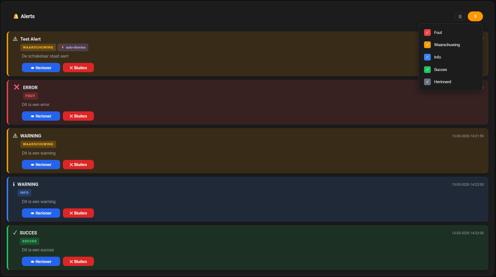

# HA Alert Card

Custom Lovelace card for the [HA Alert](https://github.com/bartjanisse/ha-alert) integration. Displays active alerts on your Home Assistant dashboard with color-coded types, timestamps, filter controls, and acknowledge and dismiss buttons.

> This card requires the HA Alert integration to be installed first.

## 📸 Preview



---

**Card version:** 1.3.0

## 📁 Installation

### Via HACS (recommended)

[](https://my.home-assistant.io/redirect/hacs_repository/?owner=bartjanisse&repository=ha-alert-card&category=plugin)

Or add it manually in HACS:
1. Open HACS in Home Assistant
2. Click the three-dot menu (top right) and choose **Custom repositories**
3. Enter `https://github.com/bartjanisse/ha-alert-card` and select **Lovelace**
4. Click **Add**, search for **HA Alert Card** and install it
5. Clear your browser or app cache (see below)

### Manual installation

1. Download `ha-alert-card.js` from the [latest release](https://github.com/bartjanisse/ha-alert-card/releases/latest)
2. Copy it to `config/www/ha-alert-card.js` on your Home Assistant server
3. Add it as a resource via **Settings → Dashboards → Resources**:
   - URL: `/local/ha-alert-card.js`
   - Type: `JavaScript module`

## ⚠️ After an update

The card is cached aggressively by browsers and the companion app. After an update, always clear the frontend cache:

**iOS companion app:** Settings (gear icon) → Companion App → Troubleshooting → Clear frontend cache

**Browser:** Ctrl+Shift+R (hard refresh)

## 🔧 Usage

Add the card to a dashboard:

```yaml
type: custom:ha-alert-card
entity: sensor.ha_alert_active_alerts
title: My Alerts
```

| Option | Required | Default | Description |
|---|---|---|---|
| `entity` | yes | | The `sensor.ha_alert_active_alerts` entity |
| `title` | no | `Active Alerts` | Card header title |

## ✨ Features

- Color-coded alert types: error (red), warning (yellow), info (blue), success (green)
- Alert title, message, and creation timestamp per alert
- Repeat badge showing the repeat interval in minutes
- Auto-dismiss badge when an alert is linked to an entity
- **Filter button** to show or hide alerts per type and hide acknowledged alerts
- Count badge showing the number of currently visible alerts
- Acknowledge button that persists across Home Assistant state refreshes
- Dismiss button that calls `ha_alert.dismiss`
- Ripple animation on button clicks
- Automatic language detection: nl, en, de, fr, es, pt, it, pl
- Fully ES5 compatible, works on iOS Safari and the companion app

## 📝 Changelog

### [1.3.0]
- Filter button added to the card header (☰)
- Filter dropdown with toggles for error, warning, info, success and acknowledged alerts
- Count badge now shows the number of visible alerts, not the total
- "No alerts match the current filter" empty state when filters hide all alerts
- Filter state persists across Home Assistant state refreshes
- Filter button turns amber when any filter is inactive
- All filter labels translated in all 8 supported languages

### [1.2.5]
- Multi-language support added (nl, en, de, fr, es, pt, it, pl)
- Card labels adapt automatically to the Home Assistant language setting

### [1.2.4] and earlier
- See the [HA Alert integration changelog](https://github.com/bartjanisse/ha-alert#changelog)
